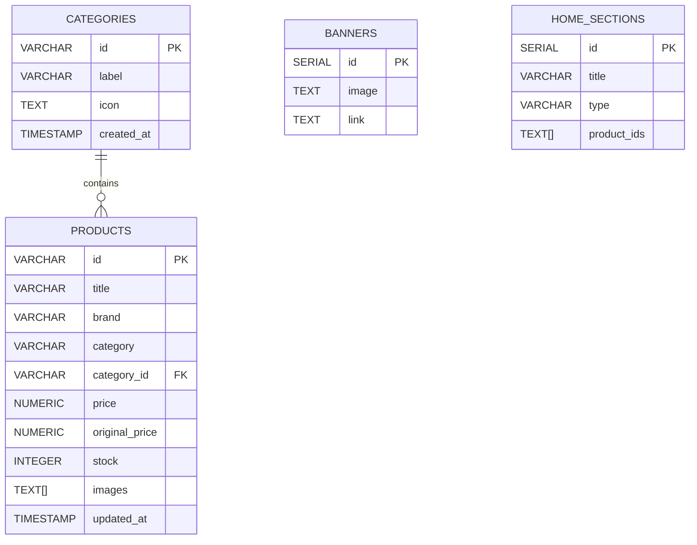

# Flipkart Clone (E-Commerce Platform)
**SDE Intern Fullstack Assignment**

A fully responsive, full-stack Single Page Application (SPA) e-commerce platform that closely replicates Flipkart's design and user experience. This project features dynamic product listings, a fully integrated shopping cart, user profile management, out-of-stock management, simulated order placement, and email dispatching.

---

## ✅ Core Features & Bonus Implementations
### What was implemented:
- **Product Listing Page:** Grid layout matching Flipkart with search and category filtering.
- **Product Detail Page:** Interactive image carousel, full spec details, price/stock tracking, and Add/Buy actions.
- **Shopping Cart:** Full CRUD with quantity limits (capped at 6 max), stock evaluation, and total summaries. 
- **Order Placement:** Complete checkout flow capturing shipping information and returning an Order Confirmation with an exclusive Order ID.
- **Order History (Bonus):** Persistent tracking allowing the user to view past orders.
- **Wishlist (Bonus):** Ability to heart products and keep a persistent wishlist.
- **Email Notifications (Bonus):** On checkout completion, chronological order summary emails are dispatched.
- **Responsive Design (Bonus):** Layout flawlessly shifts via Tailwind classes spanning Desktop, Tablet, and Mobile parameters seamlessly.

**Please Note regarding Authentication:** 
I deliberately **did not implement a traditional Login/Signup OAuth flow**. As per the assignment notes, I made the assumption that a default profile is already authenticated upon visiting the index page. Instead, I diverted complexity toward robust UI, UX, and complex feature mechanisms (Cart logic vs. "Save For Later" branching).

---

## 🚀 Tech Stack

### Frontend
- **React.js (Vite)**: For blazing-fast Single Page Application (SPA) creation.
- **Tailwind CSS**: For utility-first, fully responsive design replicating Flipkart's aesthetics.
- **React Router DOM**: Client-side routing for navigating product catalogs.
- **Context API & LocalStorage**: Global state persistence (Cart, Prev Orders, Saves, Profile).

### Backend
- **Node.js & Express.js**: RESTful API executing queries against global states and securely decrementing DB counts.
- **PostgreSQL**: Relational database managing raw category structure, banners, and item constraints. 

---

## 💾 Database Schema (4 Tables used)

I opted to completely abstract the cart into the client architecture (`localStorage`); thus, cart details are explicitly excluded from database limits. The schema relies on exactly **4 active tables**:



---

## 📌 Application Workflows

### 1. Order Processing Workflow
1. **Selection:** A user adjusts their cart (or checks out single items with "Buy Now"), adhering to frontend bounds (e.g. no more than 6 identical units).
2. **Review:** The Checkout page polls `localStorage` arrays and automatically merges it against PostgreSQL to confirm prices and exact live inventory units (`stock`).
3. **Execution:** On clicking "Place Order", a `POST` request hits `/api/orders` sending the finalized cart array.
4. **Processing (Backend):** The backend atomically locks the table (`SELECT FOR UPDATE`), validates items have not "just sold out," decrements the database, and returns a verified globally generated Order object.
5. **Finalization:** The frontend flushes the cart items from the active local cart array (`flipkart_cart`) and instead inserts the finished invoice payload into `flipkart_orders` for the history tab.

### 2. Email Dispatch Workflow
1. **Trigger:** The exact moment the `POST /api/orders` endpoint finalizes decrementing the stock securely, it immediately dispatches an async `sendOrderConfirmationEmail` command in a "fire-and-forget" pattern. 
2. **Routing:** The mailer parses the `email` stored inside the request structure (extracted universally from the user's Profile state). If the user left it blank, it falls back to a default sandbox email address. 
3. **Delivery:** The backend utilizes an SMTP transport layer framework (like `nodemailer`) to ship an HTML confirmation string matching their checkout summary straight to that address—and logs any failures locally so as not to stall the primary user order checkout flow.

---

## 📌 Critical Assumptions Made

1. **Profile Default Strategy:** Since explicit sign-in functionality is bypassed, the system utilizes a **Default Payload** containing standard profile values (E.g. `"Jeevan"`, `"9618006235"`, `"A-5, Road-1, Sagar cements"`, `"Kodad"`). **If the user doesn't alter anything in the Profile page, the site defaults to using these values implicitly.**
2. **Persistent Updates via Local Storage:** If a user modifies *any* field in their profile form or on the checkout screen, their changes dynamically commit directly into their browser's `localStorage`. All components globally (Navigation names, future checkouts, etc.) fetch straight from this updated data structure.
3. **Logout Empties Session Memory:** To simulate how authentication naturally expires, hitting **"Logout" explicitly wipes the entirety of local storage**—deleting name caches, carts, previous orders, wishlists, and arbitrary settings, entirely resetting the state bounds identically to an incognito window.
4. **Backend Concurrency:** The backend assumes thousands of users may attempt checkout; queries are actively handled directly via PostgreSQL native concurrency bounds instead of client-state verification.

---

## 🛠️ Setup Instructions

### Prerequisites
- [Node.js](https://nodejs.org/en/) (v16+ recommended)
- A PostgreSQL database instance

### 1. Database Configuration
1. Navigate to the `Backend` directory.
2. Duplicate or create a `.env` file based on your environment variables.
3. Add your distinct database connection string:
   ```env
   DATABASE_URL=postgresql://[user]:[password]@[host]/[dbname]?sslmode=require
   ```
4. Run the SQL schema found in `Backend/db/schema.sql` against your PostgreSQL database.
5. *(Optional)* Seed your database by running:
   ```bash
   node db/seed.js
   ```

### 2. Running the Backend Server
```bash
cd Backend
npm install
npm run dev
```
*The backend server will start locally (typically on port 5000).*

### 3. Running the Frontend Server
Open a new terminal window.
```bash
cd frontend
npm install
npm run dev
```
*Vite will start the frontend development server (typically on port 5173).*
